# Rapport de Projet : Jeu des Restaurants

# Groupe
Yuxiang ZHANG
Antoine LECOMTE

## Introduction
Dans le cadre de ce projet, nous avons développé un jeu stratégique où des joueurs concurrents doivent choisir quotidiennement un restaurant pour maximiser leurs chances d'être servis. Le système intègre plusieurs stratégies d'IA et permet d'analyser leurs performances sur 50 journées simulées.

## Description des choix importants d'implémentation

### Architecture technique
- **Bibliothèques utilisées** :
  - `pySpriteWorld` pour la visualisation
  - `search` pour les algorithmes de pathfinding
  - `matplotlib` pour l'analyse des résultats
- **Structure du code** :
  - Module `strategies.py` contenant les implémentations des stratégies
  - Script principal `main.py` gérant la simulation
  - Cartes personnalisées au format JSON

### Mécaniques clés
1. **Déplacement** : A* pour le chemin optimal
2. **Vision** : Champ de vision Manhattan (rayon=5) pour les joueurs utilisant greedy & greedy_complex
3. **Coupe-files** : Priorité aléatoire avec objets ramassables
4. **Score** : Cumul quotidien avec capacités de restaurants

## Description des stratégies proposées

### 1. Stratégie Têtue
**Mécanique** :
- Attribution aléatoire d'un restaurant au premier jour
- Même choix quotidien indépendamment des conditions
- Évite la compétition dynamique

### 2. Stratégie Stochastique
**Mécanique** :
- Distribution contrôlée via `probabilites`
- Permet d'éviter les schémas prévisibles
- Adaptable via ajustement des poids (ex: favoriser les restaurants peu fréquentés)

### 3. Stratégie Greedy
**Mécanique** :
- Trie les restaurants par distance Manhattan décroissante
- **Recalcul dynamique** :
  - Vérifie en temps réel la capacité (`seuil`) et l'accessibilité (`temps_restant`)
  - Met à jour les préférences via `preferences[joueur_id]`
- **Système de repli** :
  1. Restaurants sous le seuil dans le champ de vision
  2. Restaurants accessibles en temps restant
  3. Position actuelle en dernier recours

### 4. Fictitious Play
**Mécanique** :
- Calcule les fréquences historiques des choix adverses
- Cible les restaurants les moins visités (min_visits)
- Évite les stratégies majoritaires via l'historique global

### 5. Regret Matching
**Mécanique** :
- Compare les gains réels vs hypothétiques
- **Mise à jour adaptative** :
  - Probabilités proportionnelles aux regrets positifs
  - Randomisation uniforme si tous regrets ≤ 0

### 6. Stratégie Greedy Complexe
**Améliorations par rapport à Greedy** :
- Déclenche un recalcul si `seuil` dépassé
- Réévalue les choix si ≥2 joueurs immobilisés (`historique_choix_joueurs`)
- Combine distance, visibilité et comportements adverses
(Stratégie difficile à mettre en place, contient des erreurs, donc nous n'avons pas généré de graphes)

### 7. Stratégie d'Imitation
**Mécanique** :
- Identifie les meilleurs joueurs avec `max_score`
- Copie le dernier choix des meilleurs sans analyse contextuelle
- Risque de saturation des restaurants "populaires", les plus visités

### 8. Stratégie Séquence Fixe
**Mécanique** :
- Parcours cyclique des restaurants triés
- Séquence unique par joueur via `joueur_id`
- Garantit une répartition temporelle uniforme

## Description des résultats

Précisions :
- Nous avons utilisé la carte 1 (sans coupe-files) pour l'ensemble des graphes, de sorte à ne pas tronquer les résultats.
- Nous avons utilisé un seuil de 1 pour l'ensemble des tests des stratégies greedy et greedy_complex.

### Analyse comparative

| **Stratégie (1 joueur)** | **Adversaire (7 joueurs)** | **Score (1 joueur)** | **Score (7 joueurs)** | **Résultat** | **Explication** | **Image** |
|---------------------------|----------------------------|-----------------------|------------------------|--------------|-----------------|-----------------|
| **Têtue**                 | Stochastique               | 26.00                 | 26.57                  | Défaite       | La stratégie têtue est légèrement moins performante car elle ne s'adapte pas aux variations de fréquentation des restaurants, contrairement à la stratégie stochastique qui peut ajuster ses choix en fonction des probabilités. | 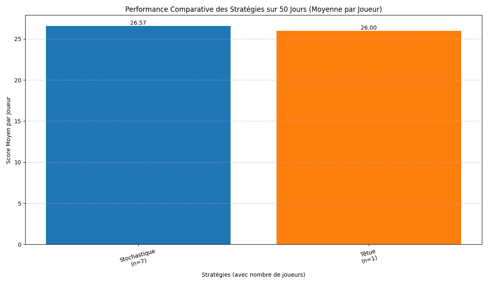 |
| **Têtue**                 | Greedy                    | 28.00                 | 30.43                  | Défaite       | La stratégie greedy exploite mieux les opportunités en temps réel, ce qui lui permet de maximiser ses chances d'être servie, tandis que la stratégie têtue reste fixe et ne profite pas des variations. |  |
| **Têtue**                 | Fictitious Play            | 50.00                 | 27.14                  | Victoire      | La stratégie têtue excelle ici car elle évite la compétition directe en restant fidèle à un restaurant, tandis que Fictitious Play s'adapte aux choix passés des autres joueurs, ce qui peut conduire à une saturation des restaurants. |  |
| **Têtue**                 | Regret Matching            | 30.00                 | 28.00                  | Victoire      | La stratégie têtue bénéficie de sa constance, tandis que Regret Matching peut être désavantagée par des ajustements fréquents qui ne sont pas toujours optimaux. |  |
| **Têtue**                 | Imitation                  | 14.57                 | 13.00                  | Victoire      | Les deux stratégies obtiennent des scores faibles en raison d'une saturation des restaurants populaires. Imitation souffre particulièrement car elle copie les choix des joueurs ayant les scores les plus élevés, ce qui peut mener à une surpopulation des mêmes restaurants. |  |
| **Têtue**                 | Séquence Fixe              | 21.00                 | 32.71                  | Défaite       | La séquence fixe répartit mieux les joueurs sur les restaurants, réduisant ainsi la concurrence directe, tandis que la stratégie têtue reste fixe et peut se retrouver dans des restaurants surpeuplés. |  |
| **Stochastique**          | Têtue                      | 22.00                 | 27.00                  | Défaite       | La stratégie têtue bénéficie de sa constance, tandis que la stratégie stochastique peut se retrouver dans des restaurants surpeuplés en raison de sa nature aléatoire. |  |
| **Stochastique**          | Greedy                     | 19.00                 | 32.00                  | Défaite       | Greedy exploite mieux les opportunités en temps réel, tandis que la stratégie stochastique manque de cohérence dans ses choix. | 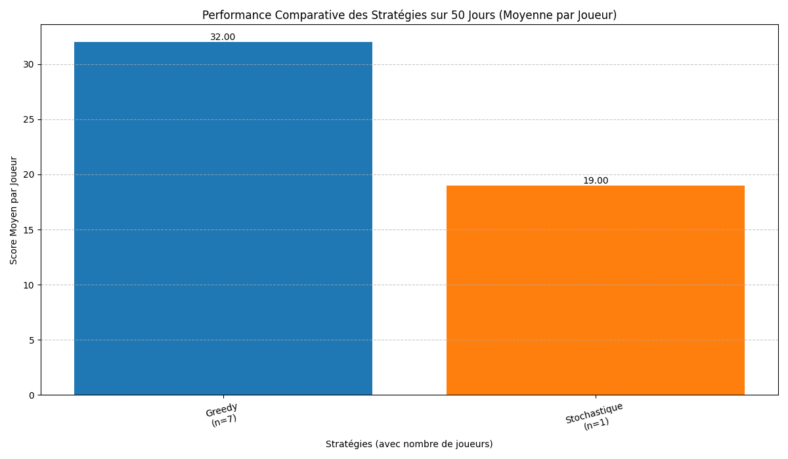 |
| **Stochastique**          | Fictitious Play            | 24.00                 | 30.00                  | Défaite       | Fictitious Play s'adapte mieux aux choix passés des autres joueurs, ce qui lui permet de maximiser ses chances d'être servie. |  |
| **Stochastique**          | Regret Matching            | 34.00                 | 26.00                  | Victoire      | La stratégie stochastique bénéficie ici de sa variabilité, qui lui permet d'éviter les schémas prévisibles et de maximiser ses chances. | 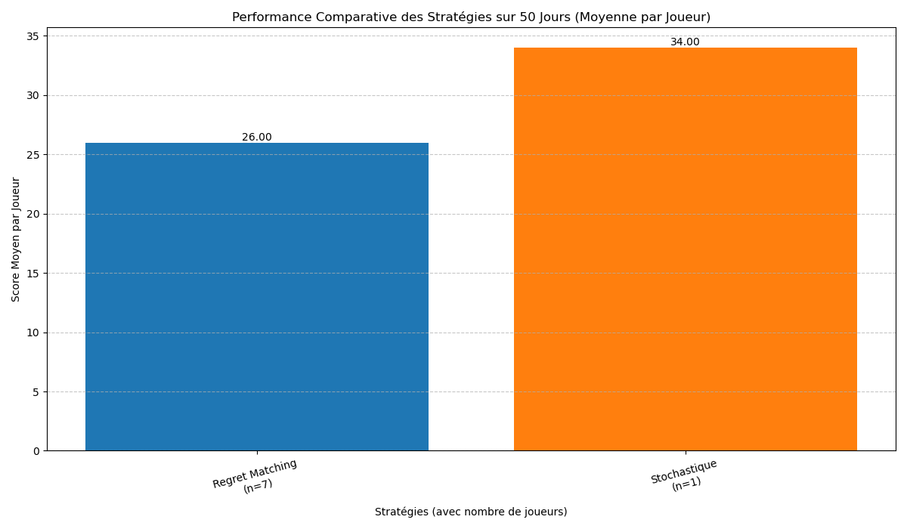 |
| **Stochastique**          | Imitation                  | 31.00                 | 22.57                  | Victoire      | Imitation souffre de la saturation des restaurants populaires, tandis que la stratégie stochastique peut mieux répartir ses choix. |  |
| **Stochastique**          | Séquence Fixe              | 29.00                 | 31.57                  | Défaite       | La séquence fixe répartit mieux les joueurs, réduisant ainsi la concurrence directe, tandis que la stratégie stochastique peut se retrouver dans des restaurants surpeuplés. |  |
| **Greedy**                | Têtue                      | 31.00                 | 27.14                  | Victoire      | Greedy exploite mieux les opportunités en temps réel, tandis que la stratégie têtue reste fixe et ne profite pas des variations. |  |
| **Greedy**                | Stochastique               | 28.00                 | 25.57                  | Victoire      | Greedy bénéficie de sa capacité à recalculer dynamiquement ses choix, tandis que la stratégie stochastique manque de cohérence. | 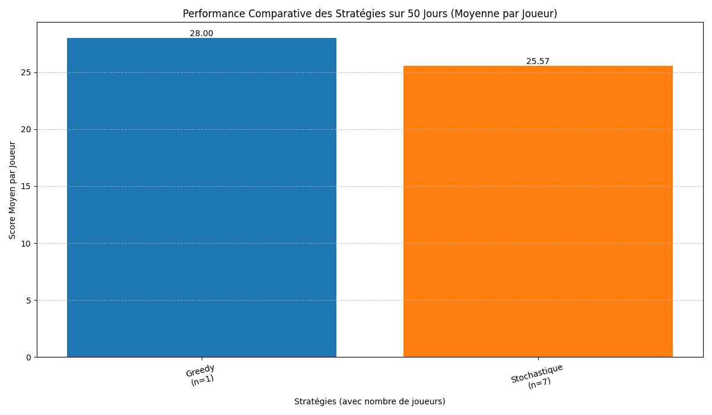 |
| **Greedy**                | Fictitious Play            | 23.00                 | 31.86                  | Défaite       | Fictitious Play s'adapte mieux aux choix passés des autres joueurs, ce qui lui permet de maximiser ses chances d'être servie. | 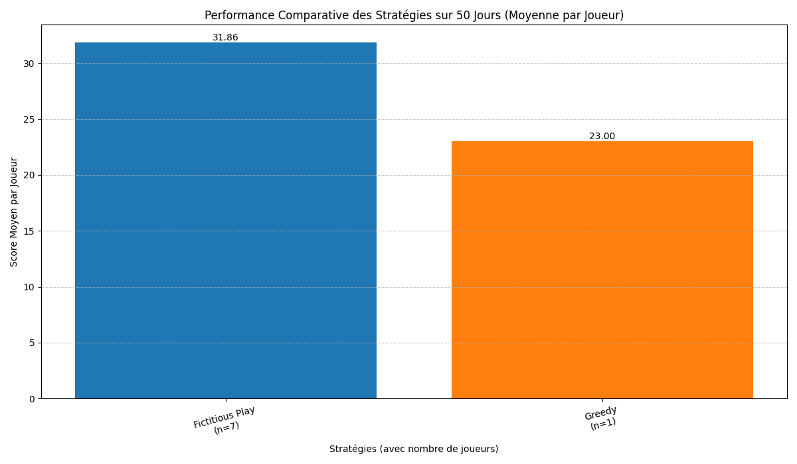 |
| **Greedy**                | Regret Matching            | 23.00                 | 28.57                  | Défaite       | Regret Matching ajuste mieux ses choix en fonction des regrets passés, ce qui lui permet de maximiser ses chances. | 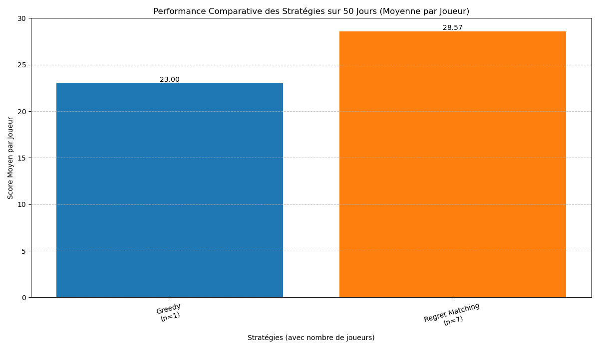 |
| **Greedy**                | Imitation                  | 29.00                 | 21.00                  | Victoire      | Imitation souffre de la saturation des restaurants populaires, tandis que Greedy peut mieux répartir ses choix. | 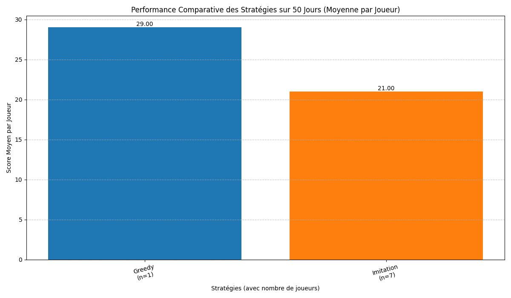 |
| **Greedy**                | Séquence Fixe              | 22.00                 | 32.57                  | Défaite       | La séquence fixe répartit mieux les joueurs, réduisant ainsi la concurrence directe, tandis que Greedy peut se retrouver dans des restaurants surpeuplés. |  |
| **Fictitious Play**       | Têtue                      | 50.00                 | 21.90                  | Victoire      | Fictitious Play s'adapte mieux aux choix passés des autres joueurs, tandis que la stratégie têtue reste fixe et peut se retrouver dans des restaurants surpeuplés. |  |
| **Fictitious Play**       | Stochastique               | 18.00                 | 27.86                  | Défaite       | La stratégie stochastique bénéficie de sa variabilité, tandis que Fictitious Play peut être désavantagée par des ajustements fréquents qui ne sont pas toujours optimaux. |  |
| **Fictitious Play**       | Greedy                     | 27.00                 | 31.29                  | Défaite       | Greedy exploite mieux les opportunités en temps réel, tandis que Fictitious Play peut être moins réactif. |  |
| **Fictitious Play**       | Regret Matching            | 31.00                 | 28.14                  | Victoire      | Fictitious Play s'adapte mieux aux choix passés des autres joueurs, tandis que Regret Matching peut être désavantagée par des ajustements fréquents. | 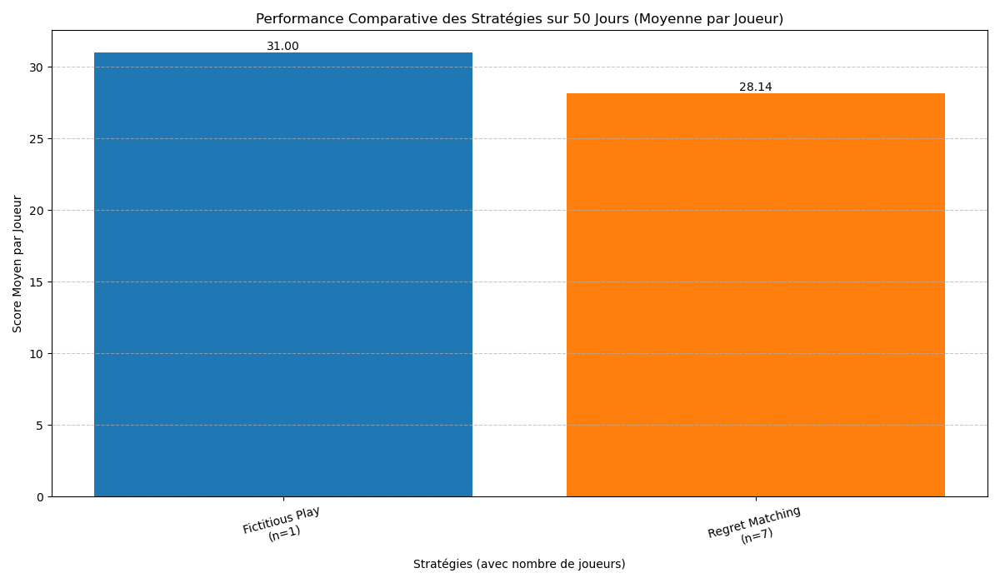 |
| **Fictitious Play**       | Imitation                  | 32.00                 | 20.86                  | Victoire      | Imitation souffre de la saturation des restaurants populaires, tandis que Fictitious Play peut mieux répartir ses choix. |  |
| **Fictitious Play**       | Séquence Fixe              | 16.00                 | 33.43                  | Défaite       | La séquence fixe répartit mieux les joueurs, réduisant ainsi la concurrence directe, tandis que Fictitious Play peut se retrouver dans des restaurants surpeuplés. | 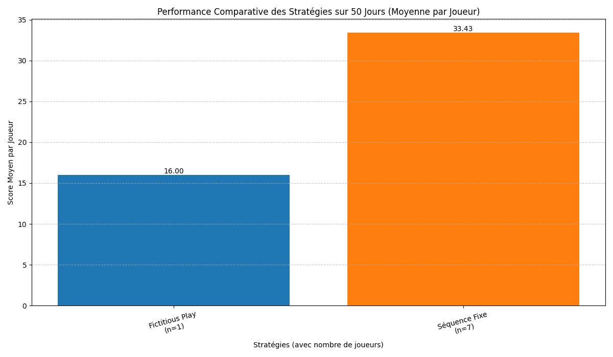 |
| **Regret Matching**       | Têtue                      | 34.00                 | 27.57                  | Victoire      | Regret Matching ajuste mieux ses choix en fonction des regrets passés, tandis que la stratégie têtue reste fixe et peut se retrouver dans des restaurants surpeuplés. | 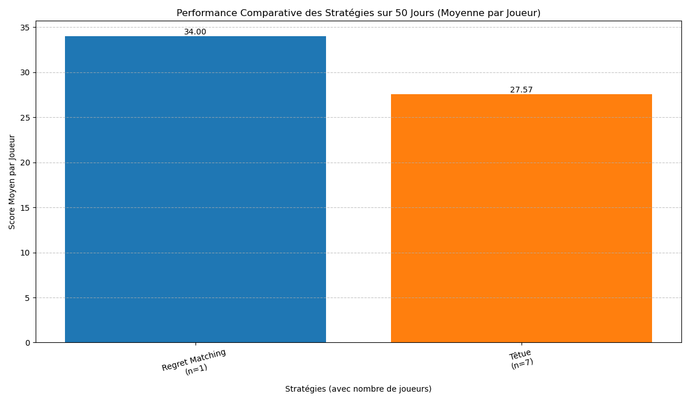 |
| **Regret Matching**       | Stochastique               | 24.00                 | 26.57                  | Défaite       | La stratégie stochastique bénéficie de sa variabilité, tandis que Regret Matching peut être désavantagée par des ajustements fréquents qui ne sont pas toujours optimaux. | 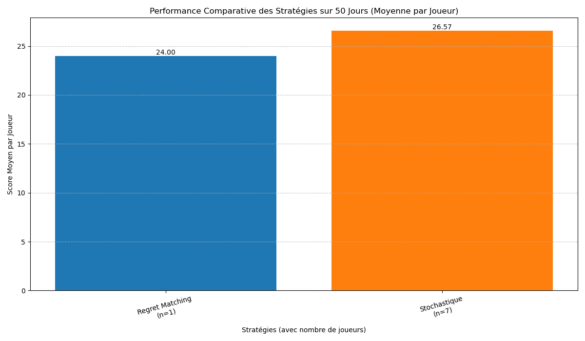 |
| **Regret Matching**       | Greedy                     | 29.00                 | 25.29                  | Victoire      | Regret Matching ajuste mieux ses choix en fonction des regrets passés, tandis que Greedy peut être moins réactif. |  |
| **Regret Matching**       | Fictitious Play            | 18.00                 | 30.71                  | Défaite       | Fictitious Play s'adapte mieux aux choix passés des autres joueurs, tandis que Regret Matching peut être désavantagée par des ajustements fréquents. |  |
| **Regret Matching**       | Imitation                  | 28.00                 | 21.43                  | Victoire      | Imitation souffre de la saturation des restaurants populaires, tandis que Regret Matching peut mieux répartir ses choix. |  |
| **Regret Matching**       | Séquence Fixe              | 28.00                 | 31.71                  | Défaite       | La séquence fixe répartit mieux les joueurs, réduisant ainsi la concurrence directe, tandis que Regret Matching peut se retrouver dans des restaurants surpeuplés. |  |
| **Imitation**             | Têtue                      | 21.00                 | 32.71                  | Défaite       | La stratégie têtue bénéficie de sa constance, tandis qu'Imitation souffre de la saturation des restaurants populaires. |  |
| **Imitation**             | Stochastique               | 24.00                 | 26.00                  | Défaite       | La stratégie stochastique bénéficie de sa variabilité, tandis qu'Imitation peut se retrouver dans des restaurants surpeuplés. | 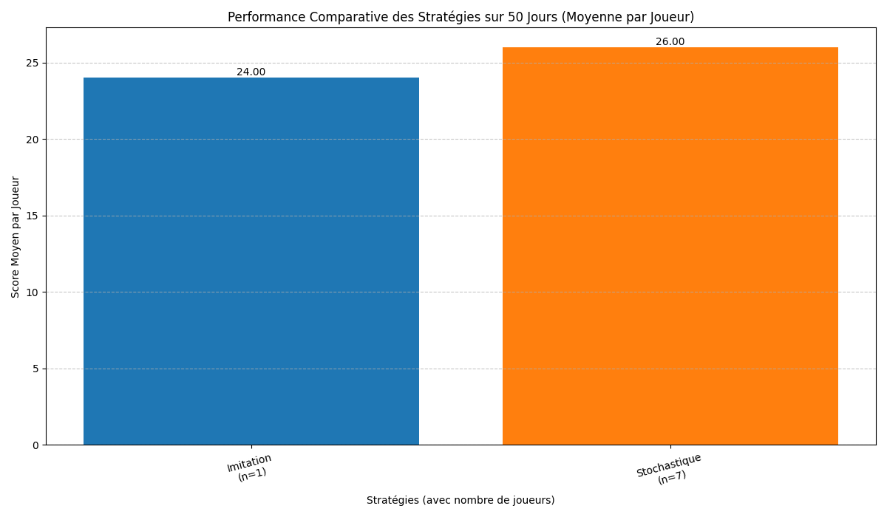 |
| **Imitation**             | Greedy                     | 25.00                 | 30.43                  | Défaite       | Greedy exploite mieux les opportunités en temps réel, tandis qu'Imitation peut se retrouver dans des restaurants surpeuplés. |  |
| **Imitation**             | Fictitious Play            | 22.00                 | 31.43                  | Défaite       | Fictitious Play s'adapte mieux aux choix passés des autres joueurs, tandis qu'Imitation peut se retrouver dans des restaurants surpeuplés. |  |
| **Imitation**             | Regret Matching            | 26.00                 | 27.43                  | Défaite       | Regret Matching ajuste mieux ses choix en fonction des regrets passés, tandis qu'Imitation peut se retrouver dans des restaurants surpeuplés. | 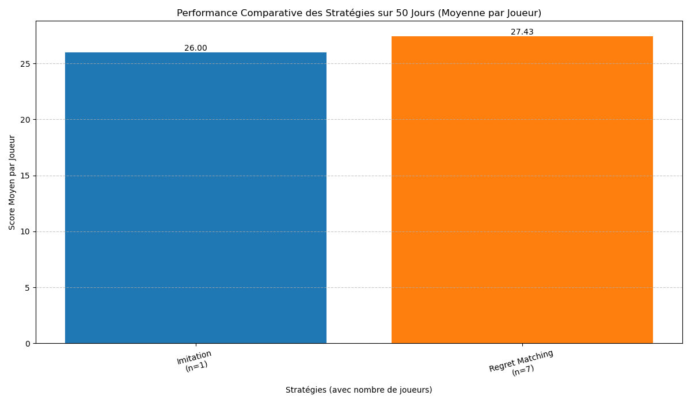 |
| **Imitation**             | Séquence Fixe              | 18.00                 | 33.14                  | Défaite       | La séquence fixe répartit mieux les joueurs, réduisant ainsi la concurrence directe, tandis qu'Imitation peut se retrouver dans des restaurants surpeuplés. |  |
| **Séquence Fixe**         | Têtue                      | 28.00                 | 20.29                  | Victoire      | La séquence fixe répartit mieux les joueurs, réduisant ainsi la concurrence directe, tandis que la stratégie têtue peut se retrouver dans des restaurants surpeuplés. |  |
| **Séquence Fixe**         | Stochastique               | 26.00                 | 25.43                  | Victoire      | La séquence fixe répartit mieux les joueurs, tandis que la stratégie stochastique peut se retrouver dans des restaurants surpeuplés. | 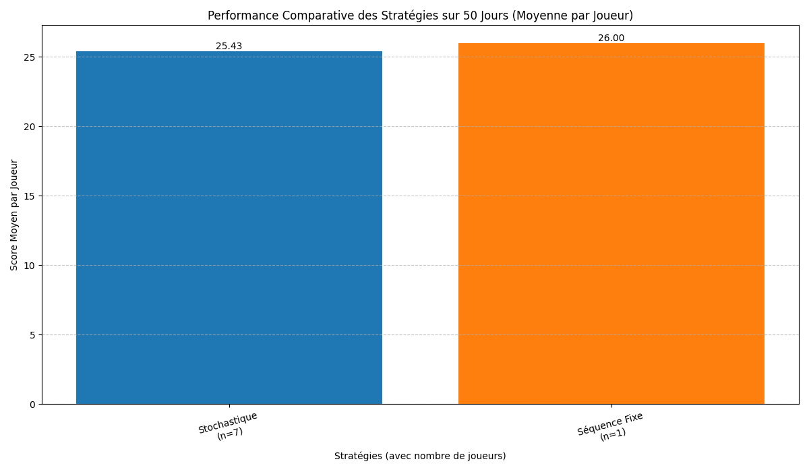 |
| **Séquence Fixe**         | Greedy                     | 32.00                 | 25.71                  | Victoire      | La séquence fixe répartit mieux les joueurs, tandis que Greedy peut se retrouver dans des restaurants surpeuplés. |  |
| **Séquence Fixe**         | Fictitious Play            | 21.00                 | 31.43                  | Défaite       | Fictitious Play s'adapte mieux aux choix passés des autres joueurs, tandis que la séquence fixe peut se retrouver dans des restaurants surpeuplés. |  |
| **Séquence Fixe**         | Regret Matching            | 24.00                 | 26.14                  | Défaite       | Regret Matching ajuste mieux ses choix en fonction des regrets passés, tandis que la séquence fixe peut se retrouver dans des restaurants surpeuplés. | 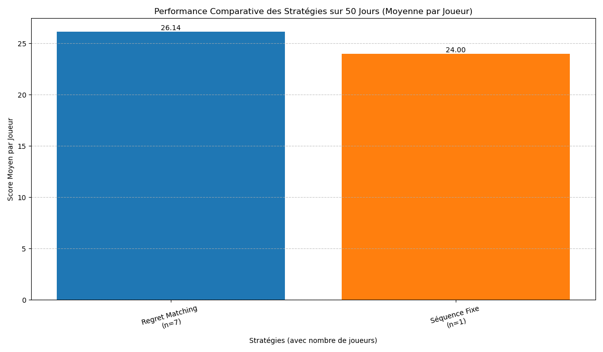 |
| **Séquence Fixe**         | Imitation                  | 32.00                 | 21.29                  | Victoire      | La séquence fixe répartit mieux les joueurs, tandis qu'Imitation peut se retrouver dans des restaurants surpeuplés. |  |

### Comparaison entre toutes les Stratégies
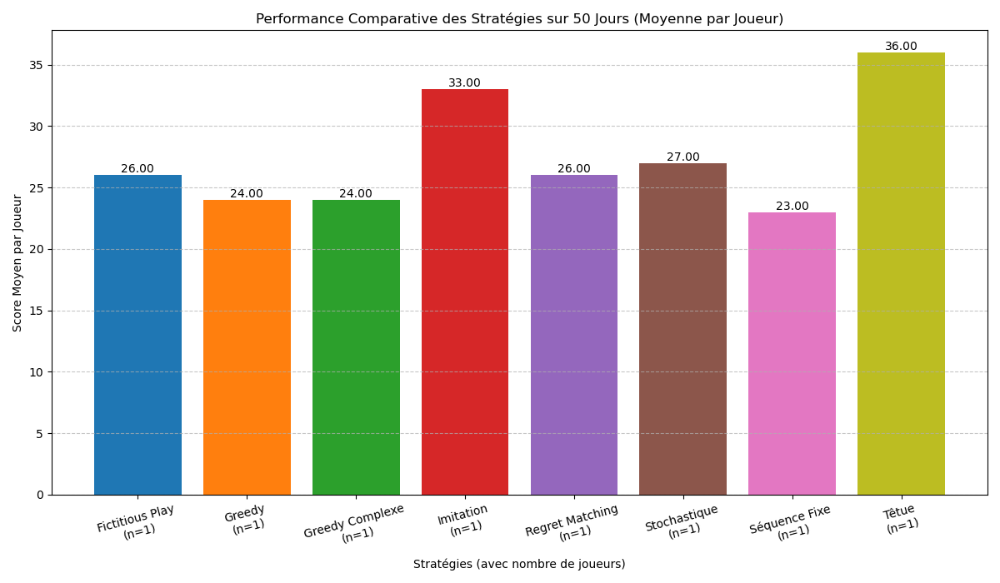
- **Têtue** : 36.00 points
- **Stochastique** : 27.00 points
- **Greedy** : 24.00 points
- **Greedy Complexe** : 24.00 points
- **Fictitious Play** : 26.00 points
- **Regret Matching** : 26.00 points
- **Imitation** : 33.00 points
- **Séquence Fixe** : 23.00 points
- **Explication** : La stratégie têtue obtient le score le plus élevé en raison de sa constance, tandis que les stratégies adaptatives comme Greedy et Fictitious Play obtiennent des scores compétitifs grâce à leur capacité à s'adapter aux variations de fréquentation. La séquence fixe et l'imitation obtiennent des scores plus faibles en raison de la saturation des restaurants populaires.
